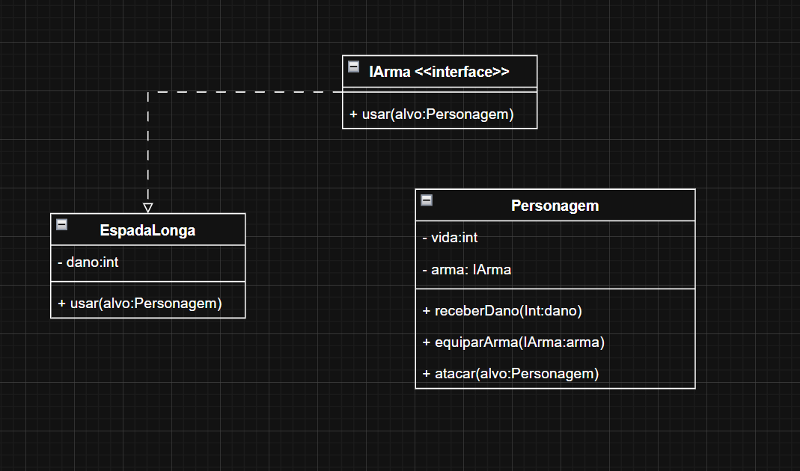

# Exercício RPG - Padrão Strategy

Este exercício demonstra a implementação do padrão de design Strategy em um sistema de RPG com diferentes tipos de armas.

## Objetivo

Implementar o padrão Strategy para gerenciar diferentes tipos de armas que um personagem pode usar em um jogo RPG.

## Estrutura

O padrão Strategy aplicado ao sistema de armas do RPG:
- **Personagem (Context)**: Classe abstrata que utiliza diferentes estratégias de armas
- **IArma (Strategy)**: Interface que define o comportamento das armas
- **EspadaLonga, ArcoElfico, CajadoArcano (ConcreteStrategy)**: Implementações específicas de cada tipo de arma
- **Guerreiro, Mago (ConcreteContext)**: Tipos específicos de personagens


## Conceitos aplicados

- Sistema flexível de equipamento de armas
- Alternância dinâmica de estratégias de combate
- Separação entre personagem e suas armas
- Facilita adição de novas armas sem modificar código existente

## Exemplo de uso

```java
Personagem heroi = new Guerreiro();
Personagem monstro = new Mago();
IArma EspadaLonga = new EspadaLonga();
IArma ArcoElfico = new ArcoElfico();
IArma CajadoArcano = new CajadoArcano();

heroi.equiparArma(EspadaLonga);
heroi.atacar(monstro, heroi);
heroi.equiparArma(ArcoElfico);
heroi.atacar(monstro, heroi);
heroi.equiparArma(CajadoArcano);
heroi.atacar(heroi, monstro);
```


