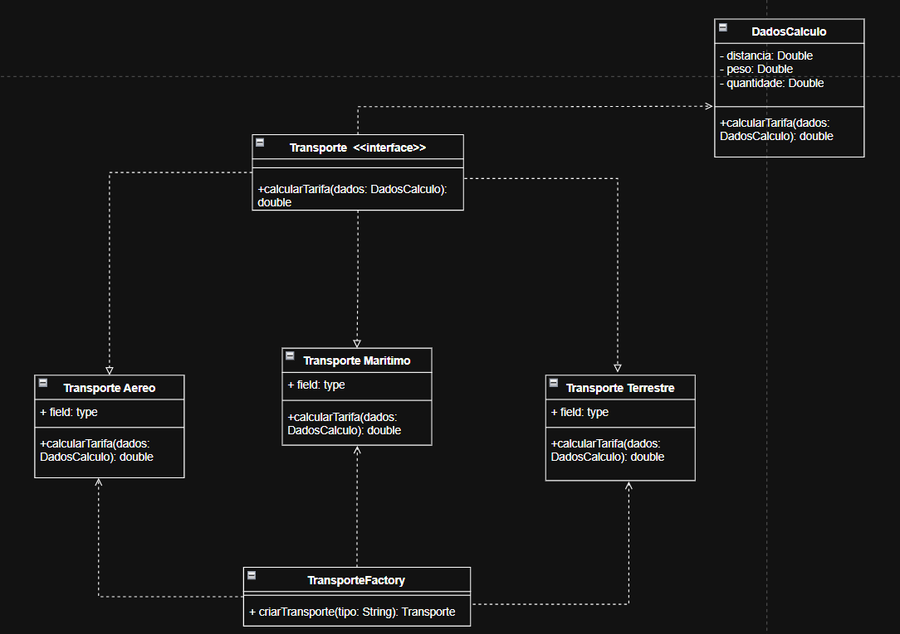

O padrão de projeto Factory Method foi escolhido para a criação dos objetos de transporte por centralizar e encapsular a lógica de instancia. Essa abordagem desacopla o código cliente das classes concretas (TransporteTerrestre, TransporteAereo, etc.), fazendo com que ele dependa apenas da interface ITransporte. Isso resulta em um sistema mais flexível e extensível.

