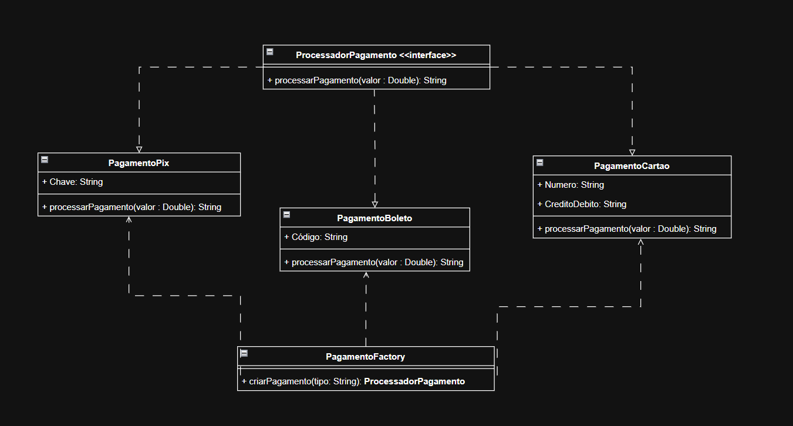

O padrão Factory foi escolhido para gerenciar a criação dos pagamentos variados sem que o código principal precisasse conhecer os detalhes de cada classe concreta.
A solução centraliza, em uma PagamentoFactory, a lógica que identifica qual o tipo de pagamento criar oque deixa o código mais escalável.

