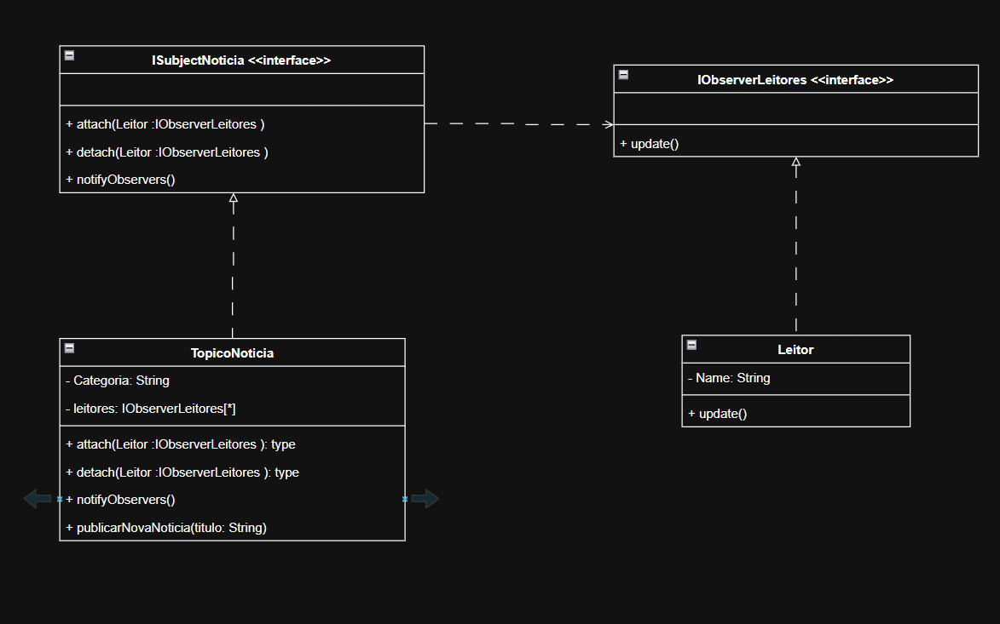

O padrão Observer foi escolhido para esta solução porque ele permite que um TopicoNoticia notifique múltiplos Leitores de forma automática, sem que o tópico precise conhecer detalhes específicos de quem são seus assinantes.

link: https://drive.google.com/file/d/1P_EYJolFqxVmOB3iRMhttgtRDXa0ym-M/view?usp=sharing