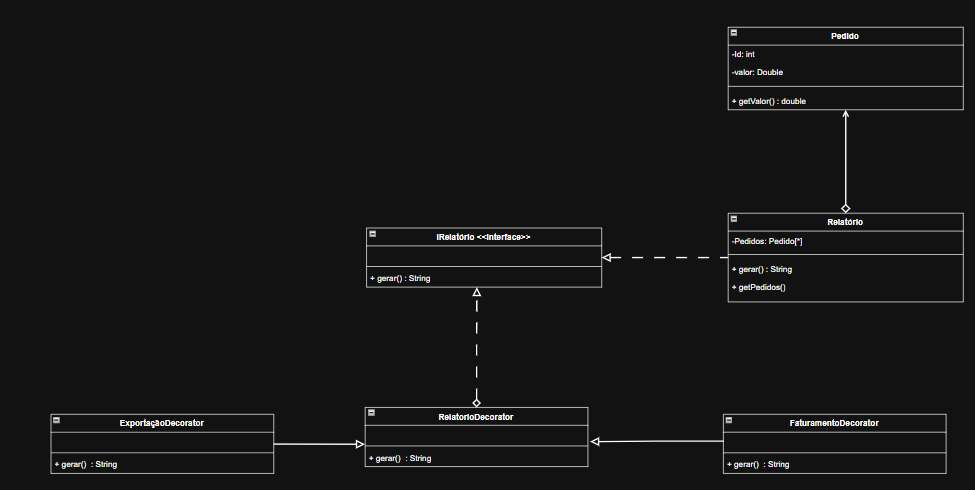

Escolhi o padrão Decorator por ser a forma mais limpa de adicionar novas funcionalidades, como gráficos ou exportação PDF, a um relatório já existente sem precisar alterar seu código-fonte.

Ele permite "envelopar" o relatório base com novas responsabilidades de forma flexível, evitando a complexidade de se criar uma subclasse para cada combinação possível de recursos e mantendo o código fácil de estender no futuro.

link: https://drive.google.com/file/d/1GwhswfPE5knjZHiuUtt6qNLwYABmE7FR/view?usp=sharing